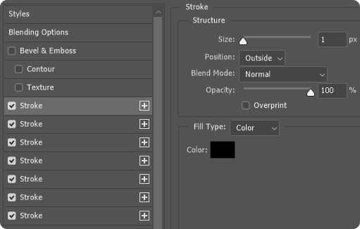
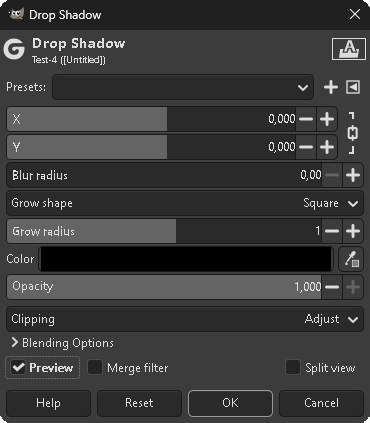

# [](https://jackkv.github.io/UOFont/)

I made a [demo](https://jackkv.github.io/UOFont/) that can also be used to share the font with others, just link them the website. `https://jackkv.github.io/UOFont/`

I created the font by tracing every pixel by hand in [Inkscape](https://gitlab.com/inkscape/inkscape), then i imported everything in [FontForge](https://github.com/fontforge/fontforge). It's a pixel-perfect replica.

I used a [WGL4 1.5](https://en.wikipedia.org/wiki/Windows_Glyph_List_4#Character_table) template, however, not every character was available in the game. It should still support most languages, as all the Latin, Greek, and Cyrillic characters are included.

If you use this font in your project, credit is not required, but it is appreciated.

## How to use

The font only works as intended when rendered at 20px, 15pt, or 1.25em. Or if scaled by an integer to maintain the aspect ratio (20px, 40px, 60px, etc).

If you scale it in an image editor, to keep the classic outline, you would first need to create the text normally, apply the outline, then merge it into a single layer and scale it as an image.

### In Web pages

I made a CSS outline, it only works if the font is set to 20px, 15pt, or 1.25em.

```css
text-shadow: 
0px -1px black, /* UP */
0px 1px black, /* DOWN */
-1px 0px black, /* LEFT */
1px 0px black, /* RIGHT */
-1px 1px black, /* UP LEFT */
1px -1px black, /* UP RIGHT */
-1px -1px black, /* DOWN LEFT */
1px 1px black; /* DOWN RIGHT */
```

If you want to scale it to 40px, add 1 pixel to the shadow like this:

```css
text-shadow:
0px -2px black, /* UP */
0px 2px black, /* DOWN */
-2px 0px black, /* LEFT */
2px 0px black, /* RIGHT */
-2px 2px black, /* UP LEFT */
2px -2px black, /* UP RIGHT */
-2px -2px black, /* DOWN LEFT */
2px 2px black; /* DOWN RIGHT */
```
For 60px, add 2 and so on.

### In Photoshop

Be sure to disable text antialiasing then go into the text layer style and apply as shown.



You need 7 strokes to have no transparent pixel, otherwise 3 are good enough.

### In Gimp

Disable text antialiasing and for the outline, i recommend using Filters > Light and Shadow > Drop Shadow as shown below.



## Copyright

This is a fan project not affiliated with Electronic Arts or Broadsword.

Ultima Online™ is a trademark of Electronic Arts Inc.
